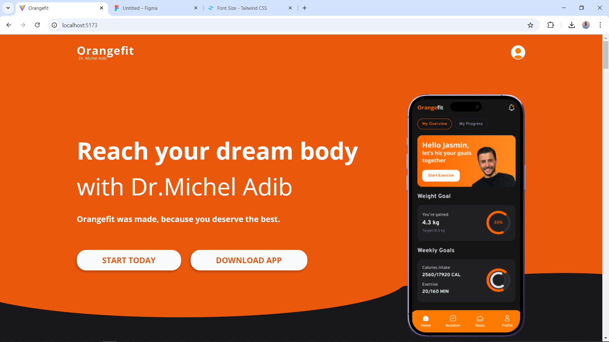

# Orangefit

This is my first poject in Raizer internsip program, My task was to built this project using React.js and Tailwind css.

### Screenshot

### Links

- Live Site URL: https://mohammad-shaar.github.io/orangefit/

## My process

### Built with

- React.js
- Tailwind css
- Semantic HTML5

### What I learned

- How to bilt a responseve website using Tailwind.
- How to work with **react-countup** package for counting up animation.
- How to work with **react-intersection-observer** package to trigger animation in when the section be visible on the screen.
- Finally, I deployed the project on **GitHub pages**.
